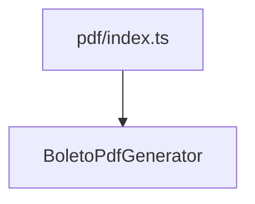

# generators/pdf/index.ts

## Overview

Exports PDF generation utilities.

## Responsibilities

- Provide public exports for PDF generators

## Inputs and outputs

- Input: N/A
- Output: PDF generator exports

## API / Signature

```ts
export * from './BoletoPdfGenerator';
```

## Main flow



## Error handling and edge cases

- No runtime logic

## Examples

```ts
import { generateBoletoPdfBuffer } from '@linkiez/boleto-sdk';
```

## Dependencies and integrations

- Used by `src/generators/index.ts`
