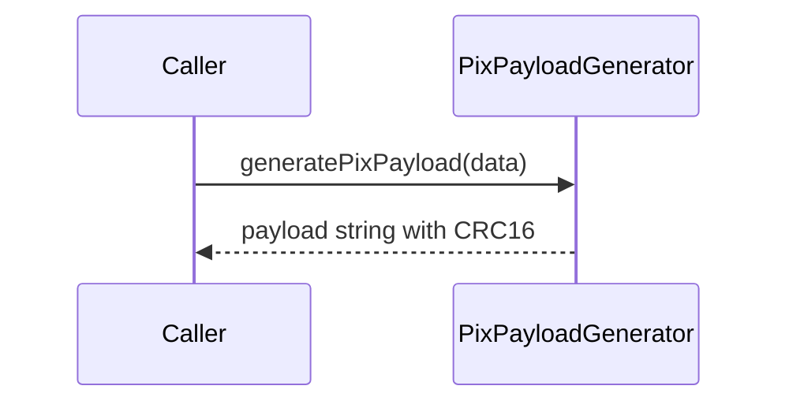

# PixPayloadGenerator

## Overview

Builds a PIX EMV payload string from core boleto and merchant data.

## Responsibilities

- Validate PIX input fields
- Build EMV TLV structure for PIX
- Calculate and append CRC16

## Inputs and outputs

- Input: `PixPayloadData`
- Output: payload `string`

## API / Signature

```ts
export interface PixPayloadData {
  key: string;
  amount?: number;
  merchantName: string;
  merchantCity: string;
  transactionId: string;
  description?: string;
}

export function generatePixPayload(data: PixPayloadData): string;
```

## Main flow



## Error handling and edge cases

- Throws when required fields are empty
- Throws when text fields exceed max length
- Throws when amount is invalid
- Throws when transaction ID is not between 1 and 25 characters

## Examples

```ts
import { generatePixPayload } from '@linkiez/boleto-sdk';

const payload = generatePixPayload({
  key: '12345678900',
  amount: 150.0,
  merchantName: 'ACME STORE',
  merchantCity: 'SAO PAULO',
  transactionId: 'INV001',
});
```

## Dependencies and integrations

- Used by `QRCodeGenerator`
