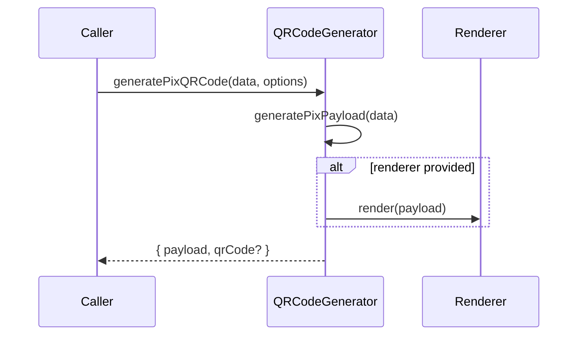

# QRCodeGenerator

## Overview

Generates a PIX payload and optionally renders a QR code using a caller-provided renderer.

## Responsibilities

- Generate PIX payload
- Invoke optional renderer to create QR code output

## Inputs and outputs

- Input: `PixPayloadData`, `PixQRCodeOptions`
- Output: `PixQRCodeResult`

## API / Signature

```ts
export interface PixQRCodeOptions {
  renderer?: (payload: string) => string;
}

export interface PixQRCodeResult {
  payload: string;
  qrCode?: string;
}

export function generatePixQRCode(
  data: PixPayloadData,
  options?: PixQRCodeOptions
): PixQRCodeResult;
```

## Main flow



## Error handling and edge cases

- Throws when payload validation fails
- Returns `qrCode` only when renderer is provided

## Examples

```ts
import { generatePixQRCode } from '@linkiez/boleto-sdk';

const result = generatePixQRCode(
  {
    key: '12345678900',
    amount: 150.0,
    merchantName: 'ACME STORE',
    merchantCity: 'SAO PAULO',
    transactionId: 'INV001',
  },
  {
    renderer: (payload) => `qr:${payload}`,
  },
);
```

## Dependencies and integrations

- Uses `PixPayloadGenerator`
