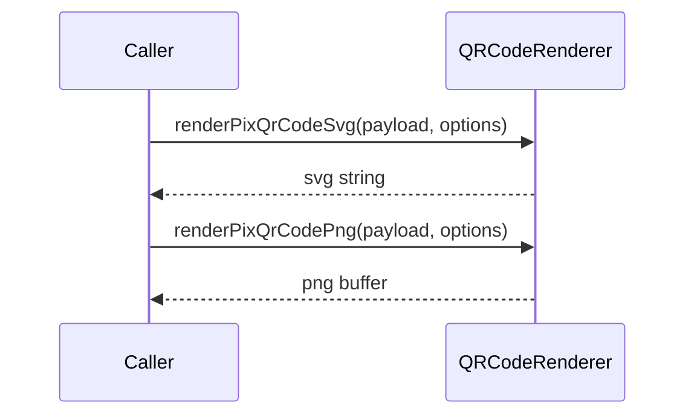

# QRCodeRenderer

## Overview

Renders PIX QR codes as SVG strings or PNG buffers using the `qrcode` library.

## Responsibilities

- Convert PIX payloads into SVG QR code markup
- Convert PIX payloads into PNG buffers
- Expose size and error correction configuration

## Inputs and outputs

- Input: `payload: string`, `QRCodeRenderOptions`
- Output: `Promise<string>` for SVG or `Promise<Buffer>` for PNG

## API / Signature

```ts
export interface QRCodeRenderOptions {
  width?: number;
  margin?: number;
  errorCorrectionLevel?: 'L' | 'M' | 'Q' | 'H';
}

export async function renderPixQrCodeSvg(
  payload: string,
  options?: QRCodeRenderOptions
): Promise<string>;

export async function renderPixQrCodePng(
  payload: string,
  options?: QRCodeRenderOptions
): Promise<Buffer>;
```

## Main flow



## Error handling and edge cases

- Throws when the QR code renderer fails to process the payload
- The caller should provide a valid PIX payload

## Examples

```ts
import { renderPixQrCodeSvg } from '@linkiez/boleto-sdk';

const svg = await renderPixQrCodeSvg('0002012633...');
```

## Dependencies and integrations

- Uses `qrcode` package
- Complements `PixPayloadGenerator`
