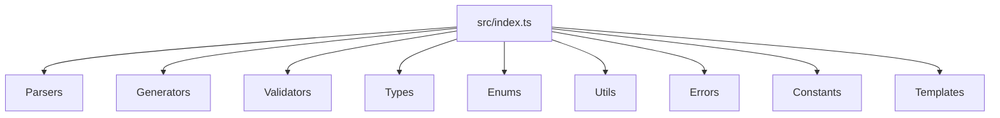

# src/index.ts

## Overview

Public SDK entry point. Re-exports parsers, generators, validators, types, enums, utilities, errors, constants, and templates.

## Responsibilities

- Provide a single import surface for consumers
- Aggregate public exports from internal modules

## Inputs and outputs

- Input: N/A
- Output: Re-exported symbols

## API / Signature

```ts
export * from './parsers';
export * from './generators';
export * from './validators';
export type * from './types';
export * from './enums';
export * from './utils';
export * from './errors';
export * from './constants';
export * from './templates';
```

## Main flow



## Error handling and edge cases

- No runtime logic

## Examples

```ts
import { parseCnab, generateCnab, GenericTemplate } from '@linkiez/boleto-sdk';
```

## Dependencies and integrations

- Aggregates exports from internal modules
