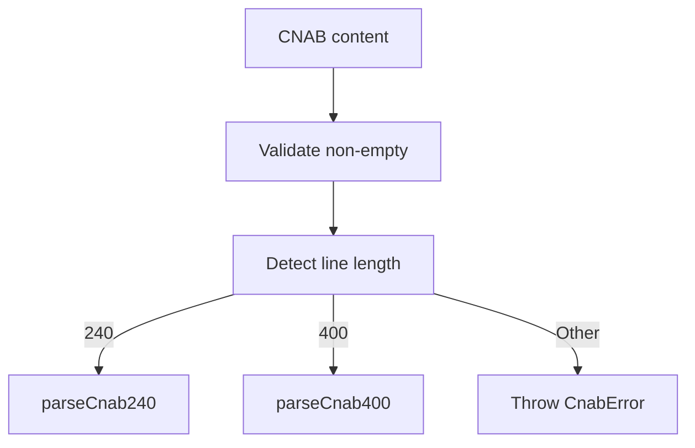

# CnabParserFactory

## Overview

Factory parser that detects CNAB format (240 or 400) and delegates parsing to the correct parser implementation.

## Responsibilities

- Validate input content
- Detect CNAB format by line length
- Route to CNAB240 or CNAB400 parser

## Inputs and outputs

- Input: CNAB file content as string
- Output: `Cnab240File | Cnab400File | Cnab400ReturnFile`

## API / Signature

```ts
export function parseCnab(content: string): Cnab240File | Cnab400File | Cnab400ReturnFile
```

## Main flow



## Error handling and edge cases

- Throws `CnabError` for empty content or invalid line length
- Delegates parse errors to format-specific parsers

## Examples

```ts
import { parseCnab } from '@linkiez/boleto-sdk';

const parsed = parseCnab(content);
```

## Dependencies and integrations

- `parseCnab240` from `src/parsers/cnab240`
- `parseCnab400` from `src/parsers/cnab400`
- `CnabError` from `src/errors`
