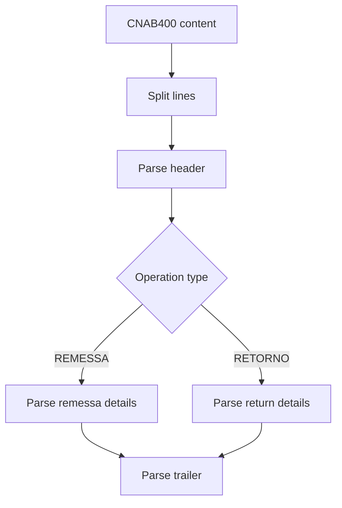

# Cnab400Parser

## Overview

Parses CNAB400 content into a structured `Cnab400File` or `Cnab400ReturnFile` depending on the operation type.

## Responsibilities

- Parse file header, details, and trailer
- Detect REMESSA vs RETORNO
- Parse optional records (penalty, message, guarantor)
- Convert date and numeric fields

## Inputs and outputs

- Input: CNAB400 content as string
- Output: `Cnab400File | Cnab400ReturnFile`

## API / Signature

```ts
export function parseCnab400(content: string): Cnab400File | Cnab400ReturnFile
```

## Main flow



## Error handling and edge cases

- Throws `ParseError` for invalid line length or record type
- Supports optional message and penalty records

## Examples

```ts
import { parseCnab400 } from '@linkiez/boleto-sdk';

const file = parseCnab400(content);
```

## Dependencies and integrations

- `FileHeaderParser`, `FileTrailerParser`
- `DetailRecordParser`, `ReturnDetailRecordParser`
- `MessageRecordParser`, `PenaltyRecordParser`, `GuarantorRecordParser`
