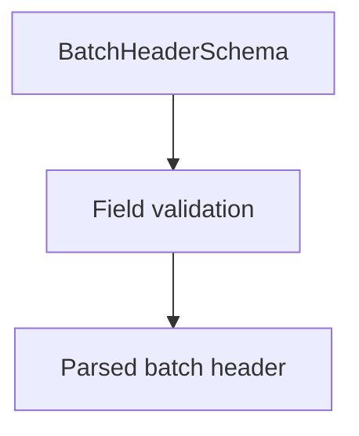

# BatchHeaderSchema

## Overview

Zod schema for CNAB240 batch header records.

## Responsibilities

- Validate batch header fields and record type `1`.
- Ensure required identifiers and company data are present.

## Inputs and outputs

- Inputs: batch header object.
- Outputs: validated batch header data.

## Main flow



## Error handling and edge cases

- Rejects invalid record type.
- Enforces service and operation types.

## Examples

```ts
import { BatchHeaderSchema } from '@/schemas/cnab240';

BatchHeaderSchema.parse({
  bankCode: '341',
  batchNumber: 1,
  recordType: '1',
  operationType: 'C',
  serviceType: '01',
  companyRegistrationType: '1',
  companyRegistrationNumber: '12345678901',
  agency: '1234',
  account: '123456',
  accountDigit: '7',
  companyName: 'ACME Corp',
});
```

## Dependencies and integrations

- Uses shared CNAB240 schemas.
