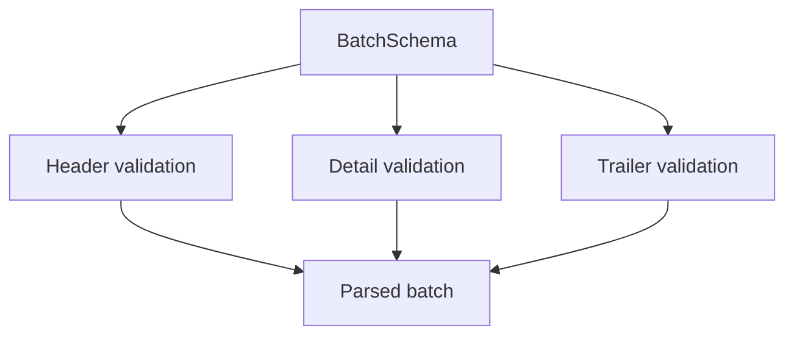

# BatchSchema

## Overview

Zod schema for CNAB240 batches.

## Responsibilities

- Validate batch header, details, and trailer.
- Ensure at least one detail record exists.

## Inputs and outputs

- Inputs: batch object.
- Outputs: validated batch data.

## Main flow



## Error handling and edge cases

- Empty `details` array is rejected.

## Examples

```ts
import { BatchSchema } from '@/schemas/cnab240';

BatchSchema.parse({
  header: { /* ... */ },
  details: [{ /* ... */ }],
  trailer: { /* ... */ },
});
```

## Dependencies and integrations

- Uses BatchHeaderSchema, DetailRecordSchema, and BatchTrailerSchema.
