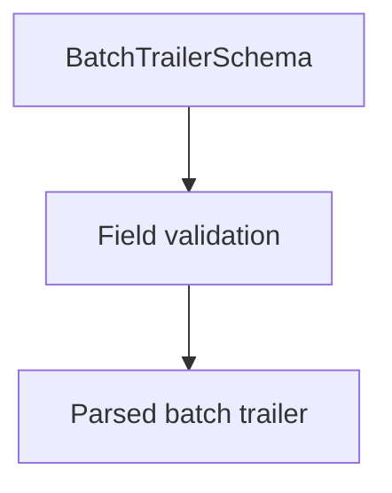

# BatchTrailerSchema

## Overview

Zod schema for CNAB240 batch trailer records.

## Responsibilities

- Validate batch totals.
- Enforce record type `5`.

## Inputs and outputs

- Inputs: batch trailer object.
- Outputs: validated batch trailer data.

## Main flow



## Error handling and edge cases

- Rejects invalid record type.
- Validates numeric totals when present.

## Examples

```ts
import { BatchTrailerSchema } from '@/schemas/cnab240';

BatchTrailerSchema.parse({
  bankCode: '341',
  batchNumber: 1,
  recordType: '5',
  totalRecords: 4,
});
```

## Dependencies and integrations

- Uses shared CNAB240 schemas.
