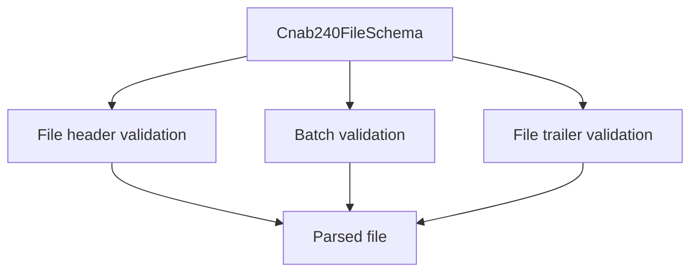

# Cnab240FileSchema

## Overview

Zod schema for complete CNAB240 files.

## Responsibilities

- Validate file header, batches, and file trailer.
- Ensure at least one batch exists.

## Inputs and outputs

- Inputs: CNAB240 file object.
- Outputs: validated CNAB240 file data.

## Main flow



## Error handling and edge cases

- Empty `batches` array is rejected.

## Examples

```ts
import { Cnab240FileSchema } from '@/schemas/cnab240';

Cnab240FileSchema.parse({
  fileHeader: { /* ... */ },
  batches: [{ /* ... */ }],
  fileTrailer: { /* ... */ },
});
```

## Dependencies and integrations

- Uses FileHeaderSchema, BatchSchema, and FileTrailerSchema.
