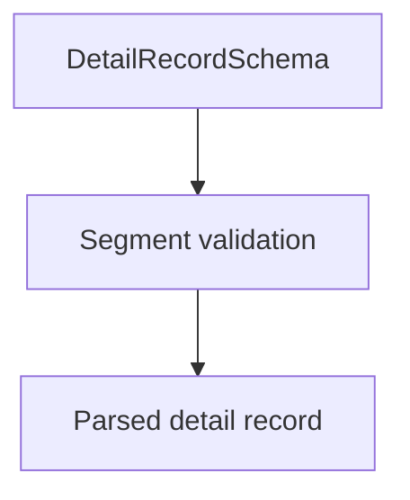

# DetailRecordSchema

## Overview

Zod schema for CNAB240 detail records composed of segments.

## Responsibilities

- Ensure required segments P and Q are present.
- Allow optional segment R.

## Inputs and outputs

- Inputs: detail record object.
- Outputs: validated detail record data.

## Main flow



## Error handling and edge cases

- Missing segment P or Q invalidates the record.

## Examples

```ts
import { DetailRecordSchema } from '@/schemas/cnab240';

DetailRecordSchema.parse({
  segmentP: { /* ... */ },
  segmentQ: { /* ... */ },
  segmentR: { /* ... */ },
});
```

## Dependencies and integrations

- Uses Segment P/Q/R schemas.
