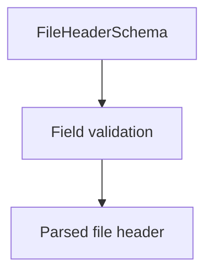

# FileHeaderSchema

## Overview

Zod schema for CNAB240 file header records.

## Responsibilities

- Validate required file header fields.
- Enforce record type and basic field formats.

## Inputs and outputs

- Inputs: file header object.
- Outputs: validated file header data.

## Main flow



## Error handling and edge cases

- Rejects invalid bank code length.
- Enforces record type `0`.

## Examples

```ts
import { FileHeaderSchema } from '@/schemas/cnab240';

FileHeaderSchema.parse({
  bankCode: '341',
  batchNumber: '0000',
  recordType: '0',
  companyRegistrationType: '1',
  companyRegistrationNumber: '12345678901',
  agency: '1234',
  account: '123456',
  accountDigit: '7',
  companyName: 'ACME Corp',
  bankName: 'BANCO ITAU SA',
  fileCode: '1',
  generationDate: new Date('2026-01-15'),
  sequentialNumber: 1,
  layoutVersion: '087',
});
```

## Dependencies and integrations

- Uses shared CNAB240 schemas.
