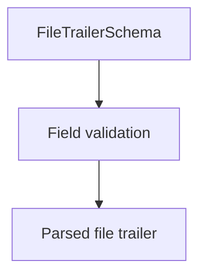

# FileTrailerSchema

## Overview

Zod schema for CNAB240 file trailer records.

## Responsibilities

- Validate required trailer fields.
- Enforce record type `9` and counts.

## Inputs and outputs

- Inputs: file trailer object.
- Outputs: validated file trailer data.

## Main flow



## Error handling and edge cases

- Rejects invalid record type.
- Validates numeric totals.

## Examples

```ts
import { FileTrailerSchema } from '@/schemas/cnab240';

FileTrailerSchema.parse({
  bankCode: '341',
  batchNumber: '9999',
  recordType: '9',
  totalBatches: 1,
  totalRecords: 6,
});
```

## Dependencies and integrations

- Uses shared CNAB240 schemas.
