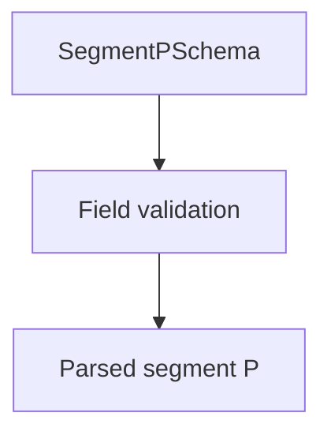

# SegmentPSchema

## Overview

Zod schema for CNAB240 Segment P records.

## Responsibilities

- Validate mandatory payment fields.
- Enforce segment code `P` and record type `3`.

## Inputs and outputs

- Inputs: segment P object.
- Outputs: validated segment P data.

## Main flow



## Error handling and edge cases

- Rejects missing required fields (amount, due date, document number).
- Validates currency code length.

## Examples

```ts
import { SegmentPSchema } from '@/schemas/cnab240';

SegmentPSchema.parse({
  bankCode: '341',
  batchNumber: 1,
  recordType: '3',
  sequentialNumber: 1,
  segmentCode: 'P',
  occurrenceCode: '01',
  agency: '1234',
  account: '123456',
  accountDigit: '7',
  ourNumber: '1234567890',
  portfolioCode: '109',
  documentNumber: 'DOC001',
  dueDate: new Date('2026-02-15'),
  amount: 100.5,
  speciesCode: '01',
  acceptance: 'N',
  issueDate: new Date('2026-01-15'),
  currencyCode: '09',
});
```

## Dependencies and integrations

- Uses shared CNAB240 schemas.
