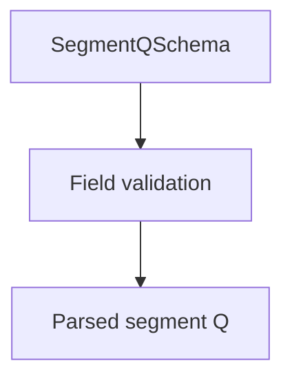

# SegmentQSchema

## Overview

Zod schema for CNAB240 Segment Q records.

## Responsibilities

- Validate payer data fields.
- Enforce segment code `Q` and record type `3`.

## Inputs and outputs

- Inputs: segment Q object.
- Outputs: validated segment Q data.

## Main flow



## Error handling and edge cases

- Validates payer tax ID length.
- Validates state code and postal code format.

## Examples

```ts
import { SegmentQSchema } from '@/schemas/cnab240';

SegmentQSchema.parse({
  bankCode: '341',
  batchNumber: 1,
  recordType: '3',
  sequentialNumber: 2,
  segmentCode: 'Q',
  occurrenceCode: '01',
  payerRegistrationType: '1',
  payerTaxId: '12345678901',
  payerName: 'John Doe',
  payerAddress: 'Street Test 123',
  payerNeighborhood: 'Centro',
  payerPostalCode: '12345678',
  payerCity: 'Sao Paulo',
  payerState: 'SP',
});
```

## Dependencies and integrations

- Uses shared CNAB240 schemas.
