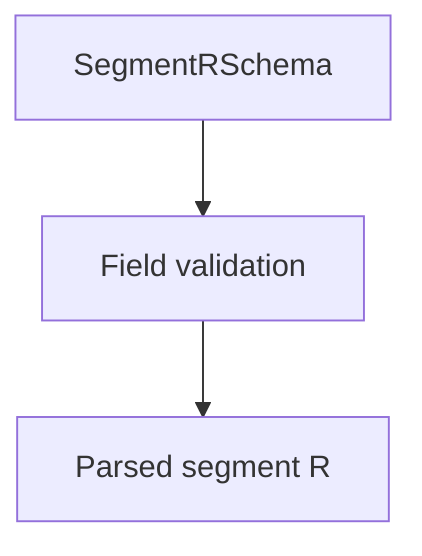

# SegmentRSchema

## Overview

Zod schema for CNAB240 Segment R records.

## Responsibilities

- Validate optional discount and fine fields.
- Enforce segment code `R` and record type `3`.

## Inputs and outputs

- Inputs: segment R object.
- Outputs: validated segment R data.

## Main flow



## Error handling and edge cases

- Accepts optional fields and validates numeric values when present.

## Examples

```ts
import { SegmentRSchema } from '@/schemas/cnab240';

SegmentRSchema.parse({
  bankCode: '341',
  batchNumber: 1,
  recordType: '3',
  sequentialNumber: 3,
  segmentCode: 'R',
  occurrenceCode: '01',
  discount2Code: '0',
  fineCode: '0',
});
```

## Dependencies and integrations

- Uses shared CNAB240 schemas.
