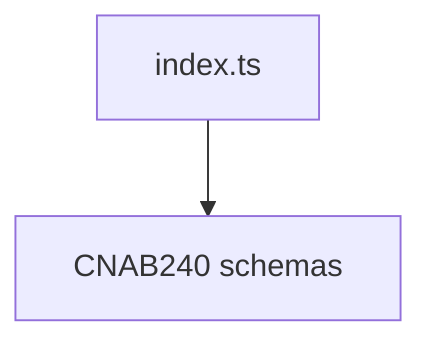

# CNAB240 Schemas Barrel

## Overview

Exports CNAB240 Zod schemas.

## Responsibilities

- Provide a single entry point for CNAB240 schemas.

## Inputs and outputs

- Inputs: none.
- Outputs: re-exports of CNAB240 schemas.

## Main flow



## Error handling and edge cases

- No runtime behavior; exports only.

## Examples

```ts
import { Cnab240FileSchema } from '@/schemas/cnab240';
```

## Dependencies and integrations

- Re-exports CNAB240 schema files.
