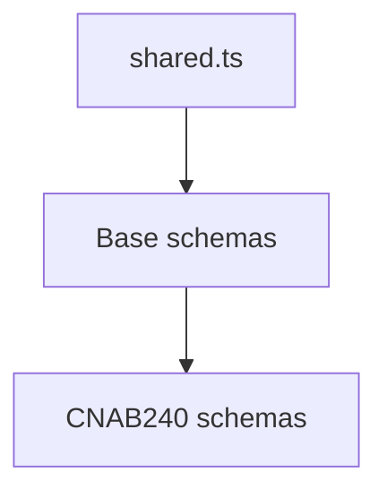

# CNAB240 Shared Schemas

## Overview

Shared Zod schema helpers for CNAB240 structures.

## Responsibilities

- Provide common validation primitives (bank code, record type, batch number).
- Centralize reusable enum and regex constraints.

## Inputs and outputs

- Inputs: raw values used in CNAB240 schemas.
- Outputs: reusable Zod schemas.

## Main flow



## Error handling and edge cases

- Enforces fixed-length numeric strings where required.
- Restricts record type literals to CNAB240 constants.

## Examples

```ts
import { BankCodeSchema } from '@/schemas/cnab240';

BankCodeSchema.parse('341');
```

## Dependencies and integrations

- Uses `RECORD_TYPE` from constants.
- Used by CNAB240 schema files.
