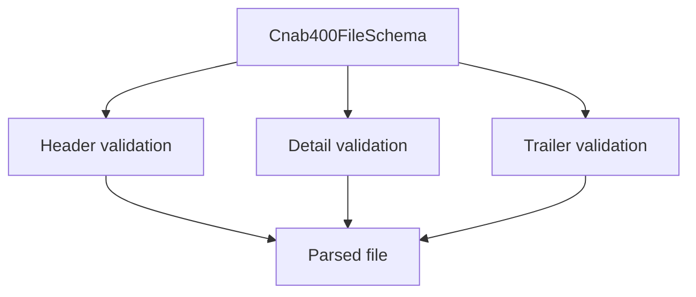

# Cnab400FileSchema

## Overview

Zod schema for complete CNAB400 files.

## Responsibilities

- Validate header, detail records, and trailer.
- Support optional record collections (penalties, messages, guarantors).

## Inputs and outputs

- Inputs: CNAB400 file object.
- Outputs: validated CNAB400 file data.

## Main flow



## Error handling and edge cases

- Requires at least one detail record.

## Examples

```ts
import { Cnab400FileSchema } from '@/schemas/cnab400';

Cnab400FileSchema.parse({
  header: { /* ... */ },
  details: [{ /* ... */ }],
  trailer: { /* ... */ },
});
```

## Dependencies and integrations

- Uses CNAB400 record schemas.
