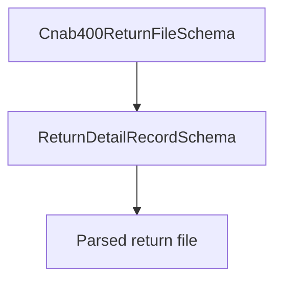

# Cnab400ReturnFileSchema

## Overview

Zod schema for CNAB400 return files.

## Responsibilities

- Validate return file with return detail records.

## Inputs and outputs

- Inputs: CNAB400 return file object.
- Outputs: validated CNAB400 return file data.

## Main flow



## Error handling and edge cases

- Requires at least one return detail record.

## Examples

```ts
import { Cnab400ReturnFileSchema } from '@/schemas/cnab400';

Cnab400ReturnFileSchema.parse({
  header: { /* ... */ },
  details: [{ /* ... */ }],
  trailer: { /* ... */ },
});
```

## Dependencies and integrations

- Extends Cnab400FileSchema with return detail records.
