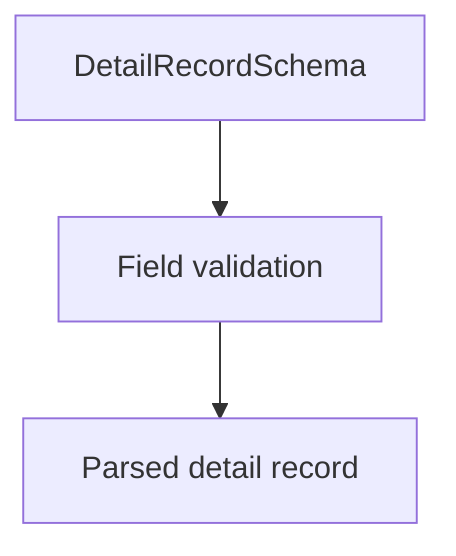

# DetailRecordSchema (CNAB400)

## Overview

Zod schema for CNAB400 detail records (type 1).

## Responsibilities

- Validate core payment and payer fields.
- Enforce record type `1`.

## Inputs and outputs

- Inputs: detail record object.
- Outputs: validated detail record data.

## Main flow



## Error handling and edge cases

- Rejects missing required payer name, amount, or due date.
- Validates tax ID length and zip code format when provided.

## Examples

```ts
import { DetailRecordSchema } from '@/schemas/cnab400';

DetailRecordSchema.parse({
  recordType: '1',
  companyRegistrationType: '02',
  companyRegistrationNumber: '12345678000195',
  agency: '0001',
  account: '12345',
  accountDigit: '6',
  ourNumber: '12345678',
  dueDate: new Date('2026-03-01'),
  amount: 150.0,
  payerName: 'JOHN DOE',
  sequentialNumber: 2,
});
```

## Dependencies and integrations

- Uses shared CNAB400 schemas.
