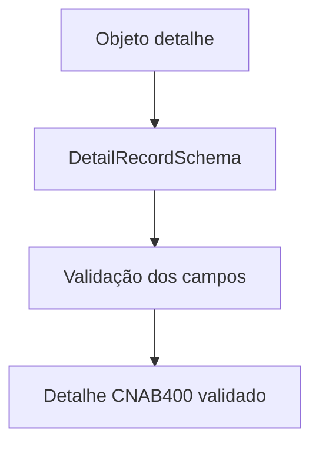

# DetailRecordSchema (CNAB400)

## Visão geral

Schema Zod para validar os registros detalhe tipo 1 do CNAB400.

## Responsabilidades

- Validar os campos essenciais do beneficiário, pagador e título.
- Validar o tipo de registro, instrução de cancelamento, tipo de carteira e sequência.
- Validar o bairro do pagador com limite de 12 caracteres.

## Entradas e saídas

- Entrada: objeto de detalhe CNAB400.
- Saída: objeto validado ou erro Zod.

## Fluxo principal


```mermaid
flowchart TD
  A[Objeto detalhe] --> B[DetailRecordSchema]
  B --> C[Validação dos campos]
  C --> D[Detalhe CNAB400 validado]
```

## Tratamento de erros e casos-limite

- Rejeita nome do pagador, valor, vencimento e campos obrigatórios ausentes.
- A instrução de cancelamento, quando informada, deve conter quatro dígitos.
- O tipo de carteira, quando informado, deve conter no máximo um caractere.
- O bairro do pagador é opcional; quando informado, deve conter no máximo 12 caracteres.
- CPF/CNPJ e CEP são validados quando informados.

## Exemplos

```ts
import { DetailRecordSchema } from '@/schemas/cnab400';

DetailRecordSchema.parse({
  recordType: '1',
  companyRegistrationType: '02',
  companyRegistrationNumber: '12345678000195',
  agency: '0001',
  account: '12345',
  accountDigit: '6',
  ourNumber: '12345678',
  dueDate: new Date('2026-03-01'),
  amount: 150.0,
  payerName: 'JOHN DOE',
  sequentialNumber: 2,
});
```

## Dependências e integrações

- Usa schemas compartilhados do CNAB400.
