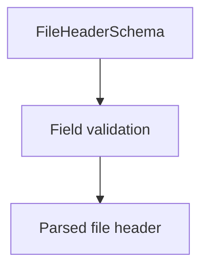

# FileHeaderSchema (CNAB400)

## Overview

Zod schema for CNAB400 file header records.

## Responsibilities

- Validate required header fields.
- Enforce record type `0` and basic formats.

## Inputs and outputs

- Inputs: file header object.
- Outputs: validated header data.

## Main flow



## Error handling and edge cases

- Rejects invalid record type.
- Validates bank code and sequence number.

## Examples

```ts
import { FileHeaderSchema } from '@/schemas/cnab400';

FileHeaderSchema.parse({
  recordType: '0',
  operationType: '1',
  operationLiteral: 'REMESSA',
  serviceCode: '01',
  serviceLiteral: 'COBRANCA',
  agency: '0001',
  account: '12345',
  accountDigit: '6',
  companyName: 'ACME CORP',
  bankCode: '341',
  bankName: 'BANCO ITAU SA',
  generationDate: new Date('2026-01-20'),
  sequenceNumber: 1,
});
```

## Dependencies and integrations

- Uses shared CNAB400 schemas.
