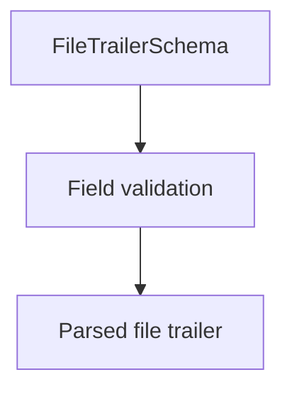

# FileTrailerSchema (CNAB400)

## Overview

Zod schema for CNAB400 file trailer records.

## Responsibilities

- Validate trailer totals and record type `9`.

## Inputs and outputs

- Inputs: file trailer object.
- Outputs: validated file trailer data.

## Main flow



## Error handling and edge cases

- Validates numeric totals and sequence number.

## Examples

```ts
import { FileTrailerSchema } from '@/schemas/cnab400';

FileTrailerSchema.parse({
  recordType: '9',
  totalRecords: 3,
  sequentialNumber: 3,
});
```

## Dependencies and integrations

- Uses shared CNAB400 schemas.
