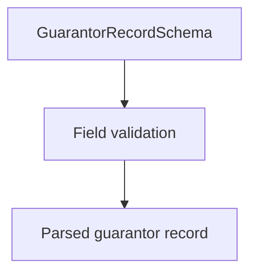

# GuarantorRecordSchema (CNAB400)

## Overview

Zod schema for CNAB400 guarantor records (type 5).

## Responsibilities

- Validate guarantor identification and document fields.
- Enforce record type `5`.

## Inputs and outputs

- Inputs: guarantor record object.
- Outputs: validated guarantor record data.

## Main flow



## Error handling and edge cases

- Requires guarantor name and document number.

## Examples

```ts
import { GuarantorRecordSchema } from '@/schemas/cnab400';

GuarantorRecordSchema.parse({
  recordType: '5',
  companyRegistrationType: '02',
  companyRegistrationNumber: '12345678000195',
  documentNumber: 'DOC123456',
  guarantorName: 'GUARANTOR COMPANY LTDA',
  guarantorZipCode: '20000000',
  guarantorCity: 'RIO DE JANEIRO',
  guarantorState: 'RJ',
  sequentialNumber: 3,
});
```

## Dependencies and integrations

- Uses shared CNAB400 schemas.
