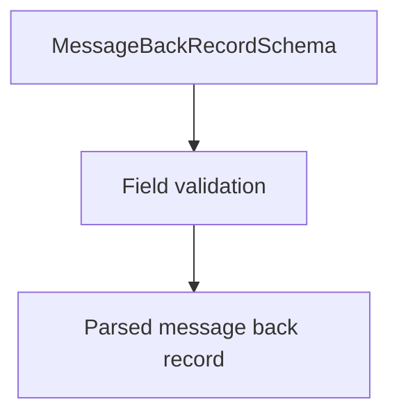

# MessageBackRecordSchema (CNAB400)

## Overview

Zod schema for CNAB400 back message records (type 8).

## Responsibilities

- Validate message fields and record type `8`.

## Inputs and outputs

- Inputs: message back record object.
- Outputs: validated message back record data.

## Main flow



## Error handling and edge cases

- Allows optional message lines.

## Examples

```ts
import { MessageBackRecordSchema } from '@/schemas/cnab400';

MessageBackRecordSchema.parse({
  recordType: '8',
  message1: 'ADDITIONAL INFORMATION',
  sequentialNumber: 5,
});
```

## Dependencies and integrations

- Uses shared CNAB400 schemas.
