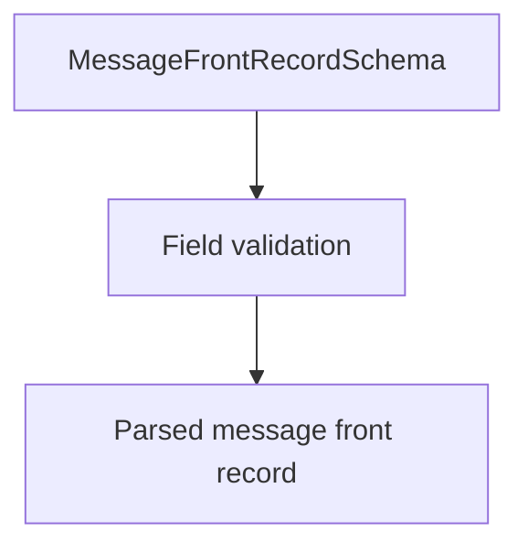

# MessageFrontRecordSchema (CNAB400)

## Overview

Zod schema for CNAB400 front message records (type 7).

## Responsibilities

- Validate message fields and record type `7`.

## Inputs and outputs

- Inputs: message front record object.
- Outputs: validated message front record data.

## Main flow



## Error handling and edge cases

- Allows optional message lines.

## Examples

```ts
import { MessageFrontRecordSchema } from '@/schemas/cnab400';

MessageFrontRecordSchema.parse({
  recordType: '7',
  message1: 'PAYMENT INSTRUCTIONS',
  sequentialNumber: 4,
});
```

## Dependencies and integrations

- Uses shared CNAB400 schemas.
