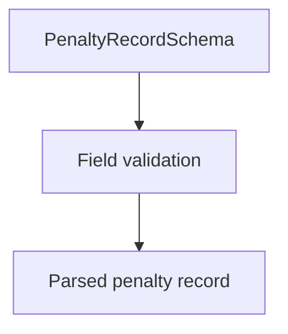

# PenaltyRecordSchema (CNAB400)

## Overview

Zod schema for CNAB400 penalty records (type 2).

## Responsibilities

- Validate penalty code and optional penalty fields.
- Enforce record type `2`.

## Inputs and outputs

- Inputs: penalty record object.
- Outputs: validated penalty record data.

## Main flow



## Error handling and edge cases

- Requires valid `penaltyCode`.
- Allows optional penalty date/value.

## Examples

```ts
import { PenaltyRecordSchema } from '@/schemas/cnab400';

PenaltyRecordSchema.parse({
  recordType: '2',
  penaltyCode: '2',
  penaltyDate: new Date('2026-03-10'),
  penaltyValue: 5,
  sequentialNumber: 3,
});
```

## Dependencies and integrations

- Uses shared CNAB400 schemas.
