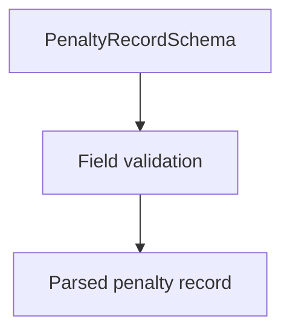

# PenaltyRecordSchema (CNAB400)

## Overview

Zod schema for CNAB400 penalty records (type 2).

## Responsibilities

- Validate the detail association metadata, Itaú penalty codes (`0` = no penalty, `1` = fixed amount, `2` = percentage), and optional penalty fields.
- Enforce record type `2`.

## Inputs and outputs

- Inputs: penalty record object.
- Outputs: validated penalty record data.

## Main flow


```mermaid
flowchart TD
  A[PenaltyRecordSchema] --> B[Field validation]
  B --> C[Parsed penalty record]
```

## Error handling and edge cases

- Requires valid `penaltyCode`.
- Rejects codes outside the Itaú values `0`, `1`, and `2`.
- Allows optional penalty date/value.
- Validates optional `detailCompanyControl` and a nonnegative integer `detailIndex`; both are parser/generator metadata and are not serialized.

## Examples

```ts
import { PenaltyRecordSchema } from '@/schemas/cnab400';

PenaltyRecordSchema.parse({
  recordType: '2',
  penaltyCode: '2',
  penaltyDate: new Date('2026-03-10'),
  penaltyValue: 5,
  sequentialNumber: 3,
});
```

## Dependencies and integrations

- Uses shared CNAB400 schemas.
