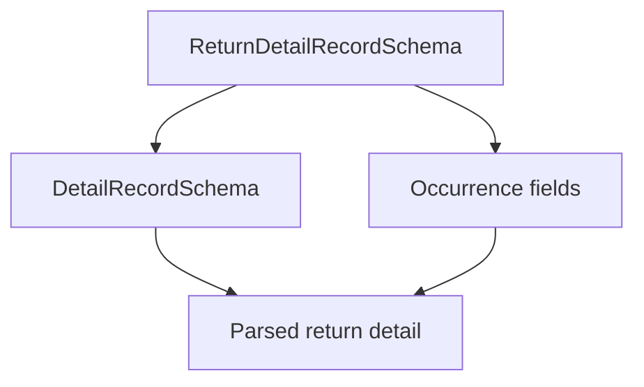

# ReturnDetailRecordSchema (CNAB400)

## Overview

Zod schema for CNAB400 return detail records.

## Responsibilities

- Extend detail record validation with occurrence fields.

## Inputs and outputs

- Inputs: return detail record object.
- Outputs: validated return detail record data.

## Main flow



## Error handling and edge cases

- Requires `occurrenceCode`.
- Accepts optional amounts and dates.

## Examples

```ts
import { ReturnDetailRecordSchema } from '@/schemas/cnab400';

ReturnDetailRecordSchema.parse({
  recordType: '1',
  companyRegistrationType: '02',
  companyRegistrationNumber: '12345678000195',
  agency: '0001',
  account: '12345',
  accountDigit: '6',
  ourNumber: '12345678',
  dueDate: new Date('2026-03-01'),
  amount: 150.0,
  payerName: 'JOHN DOE',
  sequentialNumber: 2,
  occurrenceCode: '01',
});
```

## Dependencies and integrations

- Extends DetailRecordSchema.
