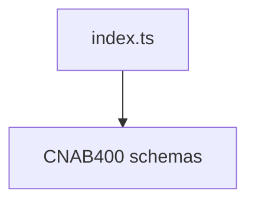

# CNAB400 Schemas Barrel

## Overview

Exports CNAB400 Zod schemas.

## Responsibilities

- Provide a single entry point for CNAB400 schemas.

## Inputs and outputs

- Inputs: none.
- Outputs: re-exports of CNAB400 schemas.

## Main flow



## Error handling and edge cases

- No runtime behavior; exports only.

## Examples

```ts
import { Cnab400FileSchema } from '@/schemas/cnab400';
```

## Dependencies and integrations

- Re-exports CNAB400 schema files.
