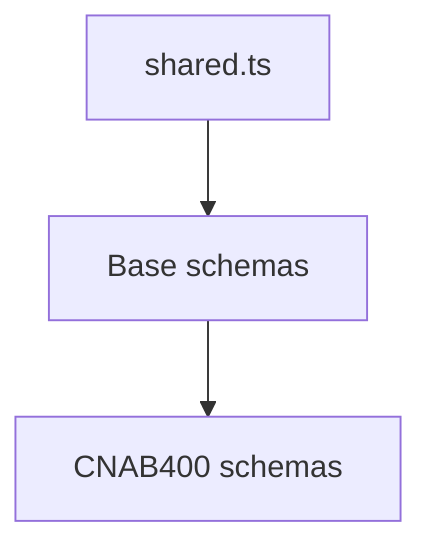

# CNAB400 Shared Schemas

## Overview

Shared Zod schema helpers for CNAB400 structures.

## Responsibilities

- Provide common validation primitives (bank code, agency, account, record type).
- Centralize reusable constraints for schema consistency.

## Inputs and outputs

- Inputs: raw field values used in CNAB400 schemas.
- Outputs: reusable Zod schemas.

## Main flow



## Error handling and edge cases

- Enforces fixed-length numeric strings where required.
- Restricts record types to CNAB400 definitions.

## Examples

```ts
import { BankCodeSchema } from '@/schemas/cnab400';

BankCodeSchema.parse('341');
```

## Dependencies and integrations

- Used by CNAB400 schema files.
