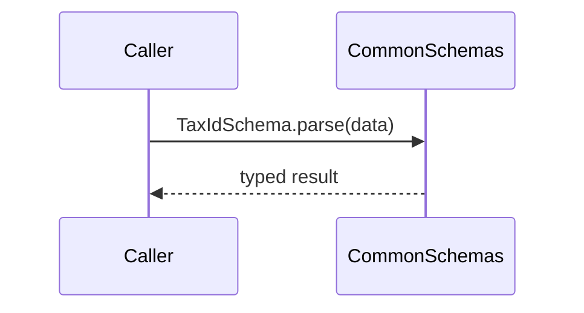

# CommonSchemas

## Overview

Defines shared Zod schemas and inferred types for boleto core entities.

## Responsibilities

- Validate common domain structures (address, tax ID, parties).
- Provide reusable schema definitions and inferred types.

## Inputs and outputs

- Inputs:
  - Raw data objects for common entities.
- Outputs:
  - Zod schema validation results and inferred TypeScript types.

## API / Signature

```ts
export const AddressSchema: z.ZodSchema;
export const TaxIdSchema: z.ZodSchema;
export const BankAccountSchema: z.ZodSchema;
export const BeneficiarySchema: z.ZodSchema;
export const PayerSchema: z.ZodSchema;
export const DiscountSchema: z.ZodSchema;
export const FeeSchema: z.ZodSchema;
export const FineSchema: z.ZodSchema;
export const InterestSchema: z.ZodSchema;

export type Address = z.infer<typeof AddressSchema>;
export type TaxId = z.infer<typeof TaxIdSchema>;
export type BankAccount = z.infer<typeof BankAccountSchema>;
export type Beneficiary = z.infer<typeof BeneficiarySchema>;
export type Payer = z.infer<typeof PayerSchema>;
export type Discount = z.infer<typeof DiscountSchema>;
export type Fee = z.infer<typeof FeeSchema>;
export type Fine = z.infer<typeof FineSchema>;
export type Interest = z.infer<typeof InterestSchema>;
```

## Main flow



## Error handling and edge cases

- `TaxIdSchema` validates CPF/CNPJ length and checksum.
- `FineSchema` rejects percentage values above 100.

## Examples

```ts
import { BeneficiarySchema } from '@schemas/common';

const parsed = BeneficiarySchema.parse({ name: 'ACME', taxId: { type: 'CNPJ', number: '12345678000195' } });
```

## Dependencies and integrations

- Depends on `validateTaxId()` from [src/utils/validators](../../utils/validators/index.ts).
- Uses Zod for schema definitions.
