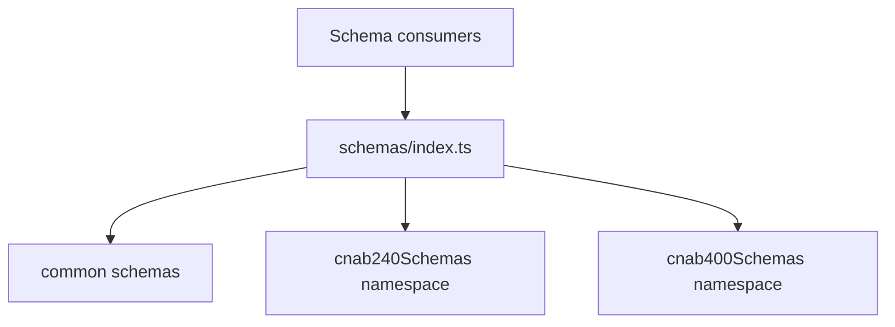

# schemas/index

## Overview

Provides access to Zod schemas with namespace exports to prevent naming collisions between CNAB240 and CNAB400 schemas.

## Responsibilities

- Re-export common schemas directly.
- Expose CNAB240 and CNAB400 schemas via namespaces.
- Keep the schema surface explicit and collision-free.

## Inputs and outputs

- Inputs: Data structures validated by Zod schemas.
- Outputs: Zod schema objects for parsing and validation.

## API / Signature

```ts
export * from './common';
export * as cnab240Schemas from './cnab240';
export * as cnab400Schemas from './cnab400';
```

## Main flow



## Error handling and edge cases

- Namespace exports avoid duplicate identifiers across CNAB240/CNAB400 schemas.

## Examples

```ts
import { cnab240Schemas, cnab400Schemas } from '@schemas';

const result240 = cnab240Schemas.Cnab240FileSchema.safeParse(data240);
const result400 = cnab400Schemas.Cnab400FileSchema.safeParse(data400);
```

## Dependencies and integrations

- Re-exports from `src/schemas/common`, `src/schemas/cnab240`, and `src/schemas/cnab400`.
- Intended for internal consumption via path aliases.
