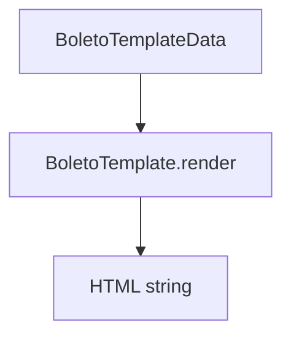

# BoletoTemplate

## Overview

Defines the data contract and interface for boleto HTML templates.

## Responsibilities

- Describe the structure required to render a boleto
- Provide a `render` contract for template implementations

## Inputs and outputs

- Input: `BoletoTemplateData`
- Output: HTML string

## API / Signature

```ts
export interface BoletoTemplateData {
  payment: {
    // ...
    pix?: {
      payload: string;
      qrCodeSvg?: string;
    };
  };
}
export interface BoletoTemplate {
  render(data: BoletoTemplateData): string;
}
```

## Main flow



## Error handling and edge cases

- Template implementations should handle optional fields gracefully

## Examples

```ts
const html = template.render(data);
```

## Dependencies and integrations

- Used by `TemplateRenderer`
- Implemented by `GenericTemplate`
