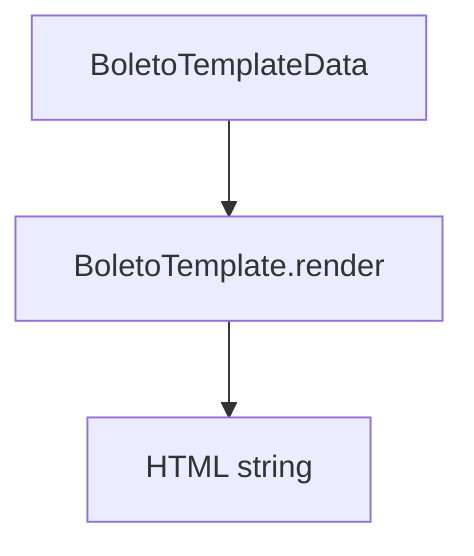

# BoletoTemplate

## Overview

Defines the data contract and interface for boleto HTML templates.

## Responsibilities

- Describe the structure required to render a boleto
- Carry optional company branding separately from the boleto beneficiary
- Provide a `render` contract for template implementations

## Inputs and outputs

- Input: `BoletoTemplateData`
- Output: HTML string
- Optional company branding: a display name and PNG/JPEG logo bytes
- `beneficiary` remains the party legally associated with the boleto

## API / Signature

```ts
export interface BoletoTemplateData {
  company?: {
    name: string;
    logo?: Buffer;
  };
  payment: {
    // ...
    pix?: {
      payload: string;
      qrCodeSvg?: string;
    };
  };
}
export interface BoletoTemplate {
  render(data: BoletoTemplateData): string;
}
```

## Main flow


```mermaid
flowchart TD
  A[BoletoTemplateData] --> B[BoletoTemplate.render]
  B --> C[HTML string]
```

## Error handling and edge cases

- Template implementations should handle optional fields gracefully
- PDF rendering falls back to the company initials when its logo is missing,
  oversized, unsupported or malformed
- Logo bytes are optional presentation data and do not replace beneficiary data

## Examples

```ts
const html = template.render(data);
```

## Dependencies and integrations

- Used by `TemplateRenderer`
- Implemented by `IndustrialIntegrityTemplate`
