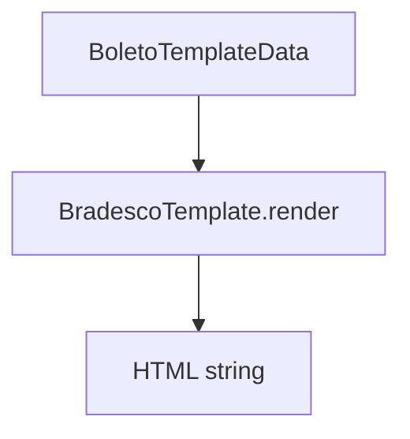

# BradescoTemplate

## Overview

HTML template for rendering Bradesco bank slips.

## Responsibilities

- Render a boleto layout with Bradesco branding
- Display core boleto information (bank, parties, amount, due date)
- Delegate layout structure to the shared HTML builder

## Inputs and outputs

- Input: `BoletoTemplateData`
- Output: HTML string

## API / Signature

```ts
export class BradescoTemplate implements BoletoTemplate {
  render(data: BoletoTemplateData): string;
}
```

## Main flow



## Error handling and edge cases

- Renders bank logo only when `bank.logo` is provided

## Examples

```ts
const html = new BradescoTemplate().render(data);
```

## Dependencies and integrations

- `buildBoletoHtml` from `src/templates/HtmlTemplateBuilder`
- `BoletoTemplate` interface
