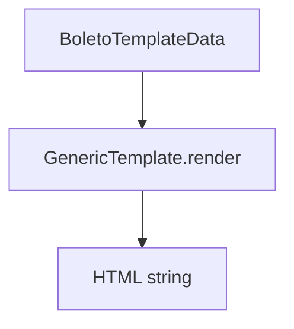

# GenericTemplate

## Overview

Basic HTML template for rendering a boleto with minimal information.

## Responsibilities

- Render a simple boleto layout
- Display bank, beneficiary, payer, amount, and due date
- Delegate layout structure to the shared HTML builder

## Inputs and outputs

- Input: `BoletoTemplateData`
- Output: HTML string

## API / Signature

```ts
export class GenericTemplate implements BoletoTemplate {
  render(data: BoletoTemplateData): string;
}
```

## Main flow



## Error handling and edge cases

- Uses the shared HTML builder defaults for formatting

## Examples

```ts
const html = new GenericTemplate().render(data);
```

## Dependencies and integrations

- `buildBoletoHtml` from `src/templates/HtmlTemplateBuilder`
