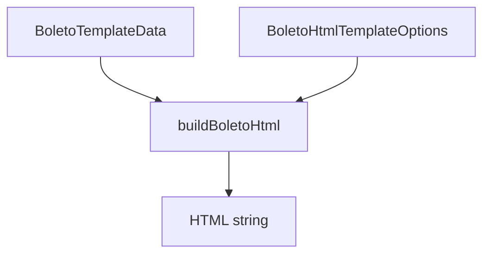

# HtmlTemplateBuilder

## Overview

Builds a complete HTML document for boleto rendering using a shared layout.

## Responsibilities

- Compose a printable HTML document
- Standardize layout and CSS across templates
- Render core boleto sections (parties, payment, instructions, barcode, PIX)
- Provide responsive and print-optimized styling
- Default labels and messages in pt-BR

## Inputs and outputs

- Input: `BoletoTemplateData`, `BoletoHtmlTemplateOptions`
- Output: HTML string

## API / Signature

```ts
export interface BoletoHtmlTemplateOptions {
  title?: string;
  heading?: string;
  bankLabel?: string;
  bankCodeLabel?: string;
  showBankName?: boolean;
}

export function buildBoletoHtml(
  data: BoletoTemplateData,
  options?: BoletoHtmlTemplateOptions,
): string;
```

## Main flow



## Error handling and edge cases

- Missing instructions/additional info render as placeholder text
- Optional bank logo is rendered only when provided
- Uses pt-BR labels by default (override via options)
- PIX section renders only when `data.payment.pix` is provided

## Examples

```ts
const html = buildBoletoHtml(data, {
  title: 'Boleto - Itaú',
  heading: 'Boleto Itaú',
  bankCodeLabel: 'Código do banco',
});
```

## Dependencies and integrations

- `formatMoney` from `src/utils/formatters`
- Used by `GenericTemplate` and `ItauTemplate`
