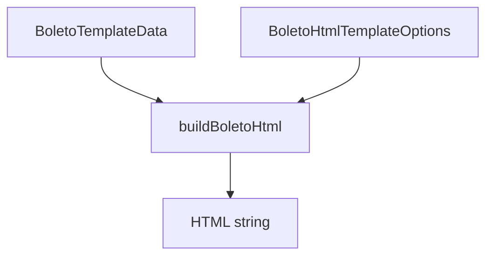

# HtmlTemplateBuilder

## Overview

Builds a complete HTML document for boleto rendering using a classic banking layout (recibo do sacado + ficha de compensação).

## Responsibilities

- Compose a printable HTML document
- Standardize the classic boleto table structure and CSS across templates
- Render core boleto sections (cedente, sacado, payment fields, deductions block, barcode, PIX)
- Provide responsive and print-optimized styling
- Default labels and messages in pt-BR

## Inputs and outputs

- Input: `BoletoTemplateData`, `BoletoHtmlTemplateOptions`
- Output: HTML string

## API / Signature

```ts
export interface BoletoHtmlTemplateOptions {
  title?: string;
  heading?: string;
  bankLabel?: string;
  bankCodeLabel?: string;
  showBankName?: boolean;
  layout?: 'simple' | 'instructions' | 'detailed';
}

export function buildBoletoHtml(
  data: BoletoTemplateData,
  options?: BoletoHtmlTemplateOptions,
): string;

export interface BoletoHtmlPixDependencies {
  renderPixQrCodeSvg?: typeof renderPixQrCodeSvg;
}

export async function buildBoletoHtmlWithPixQrCode(
  data: BoletoTemplateData,
  options?: BoletoHtmlTemplateOptions,
  dependencies?: BoletoHtmlPixDependencies,
): Promise<string>;
```

## Main flow



## Error handling and edge cases

- Missing optional fields render with safe fallbacks (for example agency code, sacador/avalista)
- Optional bank logo is rendered only when provided
- Uses pt-BR labels by default (override via options)
- Bank code check digit is resolved from `BankRegistry` (with fallback in `additionalInfo.bankCheckDigit`)
- PIX section renders only when `data.payment.pix` is provided
- `buildBoletoHtmlWithPixQrCode` renders `qrCodeSvg` automatically when only a PIX payload is provided
- Dynamic values are HTML-escaped before rendering
- `layout: 'simple'` hides instruction content
- `layout: 'instructions'` renders instructions without extra additional-info entries

## Examples

```ts
const html = buildBoletoHtml(data, {
  title: 'Boleto - Itaú',
  heading: 'Boleto Itaú',
  bankCodeLabel: 'Código do banco',
});

const htmlWithPix = await buildBoletoHtmlWithPixQrCode(data);
```

## Dependencies and integrations

- `formatMoney` from `src/utils/formatters`
- `renderPixQrCodeSvg` from `src/generators/qrcode/QRCodeRenderer`
- `validatePixPayload` from `src/generators/qrcode/PixPayloadValidator`
- Used by `IndustrialIntegrityTemplate`
