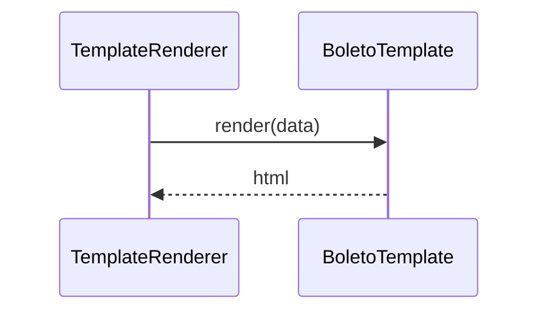

# TemplateRenderer

## Overview

Simple renderer that delegates HTML generation to a template instance.

## Responsibilities

- Accept a template and data
- Return the HTML string generated by the template

## Inputs and outputs

- Input: `BoletoTemplate`, `BoletoTemplateData`
- Output: HTML string

## API / Signature

```ts
export class TemplateRenderer {
  render(template: BoletoTemplate, data: BoletoTemplateData): string;
}
```

## Main flow



## Error handling and edge cases

- Propagates template errors to the caller

## Examples

```ts
const html = renderer.render(template, data);
```

## Dependencies and integrations

- Depends on `BoletoTemplate`
