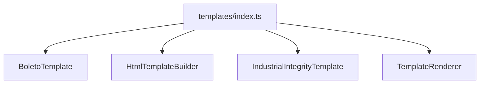

# templates/index.ts

## Overview

Exports boleto template interfaces and implementations.

## Responsibilities

- Provide public exports for template types and classes

## Inputs and outputs

- Input: N/A
- Output: Template exports

## API / Signature

```ts
export * from './BoletoTemplate';
export * from './HtmlTemplateBuilder';
export * from './IndustrialIntegrityTemplate';
export * from './TemplateRenderer';
```

## Main flow



## Error handling and edge cases

- No runtime logic

## Examples

```ts
import { IndustrialIntegrityTemplate, TemplateRenderer } from '@linkiez/boleto-sdk';
```

## Dependencies and integrations

- Used by public exports in `src/index.ts`
