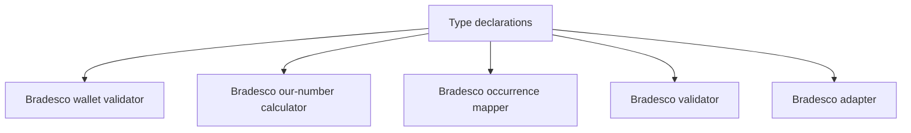

# types/adapters/bradesco/index.ts

## Overview

Defines Bradesco adapter type contracts.

## Responsibilities

- Declare supported Bradesco wallet union type.
- Declare Bradesco wallet configuration contract.
- Declare Bradesco "our number" check digit and result contracts.
- Declare Bradesco occurrence mapping contracts.
- Declare Bradesco remittance and return validation field contracts.
- Declare enriched Bradesco CNAB400/CNAB240 adapter detail contracts.

## Inputs and outputs

- Input: N/A
- Output: Type declarations.

## API / Signature

```ts
export type BradescoWalletCode = '09' | '19' | '26';

export interface BradescoWalletConfig {
  code: BradescoWalletCode;
  description: string;
  cnab240PortfolioCode: string;
  cnab400WalletType: string;
  aliases: readonly string[];
}

export type BradescoOurNumberCheckDigit =
  | '0'
  | '1'
  | '2'
  | '3'
  | '4'
  | '5'
  | '6'
  | '7'
  | '8'
  | '9'
  | 'P';

export interface BradescoOurNumberResult {
  baseNumber: string;
  checkDigit: BradescoOurNumberCheckDigit;
  formatted: string;
}

export type BradescoOccurrenceCategory =
  | 'entry'
  | 'liquidation'
  | 'rejection'
  | 'protest'
  | 'cancellation'
  | 'other';

export interface BradescoOccurrenceMapping {
  code: string;
  description: string;
  category: BradescoOccurrenceCategory;
}

export interface BradescoRemittanceFields {
  instructionCode: string;
  walletNumber: string;
  walletType: string;
  occurrenceCode: string;
  daysCount: number;
}

export interface BradescoReturnFields {
  walletNumber: string;
  walletType: string;
  occurrenceCode: string;
  ourNumber?: string;
  ourNumberCheckDigit?: string;
  confirmedOurNumber?: string;
  confirmedOurNumberCheckDigit?: string;
}

export interface BradescoCnab400RemittanceDetail {
  movementType: 'remittance';
  detail: DetailRecord;
  fields: BradescoRemittanceFields;
  wallet?: BradescoWalletConfig;
  validation: { isValid: boolean; errors: string[] };
}

export interface BradescoCnab400ReturnDetail {
  movementType: 'return';
  detail: ReturnDetailRecord;
  fields: BradescoReturnFields;
  wallet?: BradescoWalletConfig;
  occurrence?: BradescoOccurrenceMapping;
  validation: { isValid: boolean; errors: string[] };
}

export interface BradescoCnab240Segment {
  movementType: 'cnab240';
  detail: Cnab240DetailRecord;
  walletNumber?: string;
  wallet?: BradescoWalletConfig;
  occurrenceCode: string;
  occurrence?: BradescoOccurrenceMapping;
  validation: { isValid: boolean; errors: string[] };
}
```

## Main flow



## Error handling and edge cases

- Not applicable (type-only module).

## Examples

```ts
const walletCode: BradescoWalletCode = '19';

const numberResult: BradescoOurNumberResult = {
  baseNumber: '12345678901',
  checkDigit: '8',
  formatted: '12345678901-8',
};

const remittanceFields: BradescoRemittanceFields = {
  instructionCode: '00',
  walletNumber: '19',
  walletType: 'R',
  occurrenceCode: '01',
  daysCount: 0,
};
```
