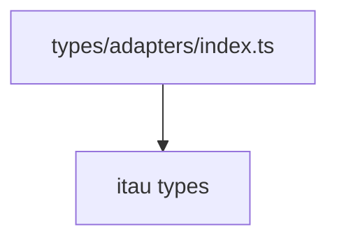

# types/adapters/index.ts

## Overview

Aggregates type exports for bank adapters.

## Responsibilities

- Re-export adapter-specific type definitions.

## Inputs and outputs

- Input: N/A
- Output: Adapter type exports.

## API / Signature

```ts
export * from './itau';
```

## Main flow



## Error handling and edge cases

- No runtime logic.

## Examples

```ts
import type { ItauWalletCode } from '@linkiez/boleto-sdk';
```

## Dependencies and integrations

- Depends on `src/types/adapters/itau/index.ts`.
