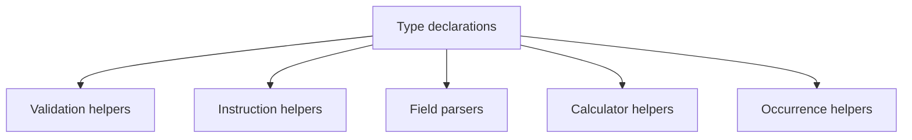

# types/adapters/itau/index.ts

## Overview

Defines Itaú adapter type contracts.

## Responsibilities

- Declare supported wallet union type.
- Declare wallet configuration contract.
- Declare structured result for "our number" calculation.
- Declare typed Itaú CNAB400 remittance/return field extraction results.
- Declare supported Itaú instruction codes and normalized mapping types.
- Declare supported Itaú occurrence codes and normalized mapping types.
- Declare supported Itaú liquidation codes and normalized mapping types.
- Declare enriched Itaú CNAB400 remittance and return detail contracts.
- Declare enriched Itaú CNAB240 detail contract.

## Inputs and outputs

- Input: N/A
- Output: Type declarations.

## API / Signature

```ts
export type ItauWalletCode = '109' | '112' | '115' | '180';

export interface ItauWalletConfig {
  code: ItauWalletCode;
  description: string;
  cnab240PortfolioCode: string;
  cnab400WalletType: 'I';
}

export interface ItauOurNumberResult {
  baseNumber: string;
  checkDigit: number;
  formatted: string;
}

export type ItauInstructionCode = '00' | '01' | ... | '15';

export interface ItauInstructionMapping {
  code: ItauInstructionCode;
  commonCode?: CommonInstructionCode;
  description: string;
}

export interface ItauRemittanceFields {
  instructionCancellationCode: string;
  bankUseOperation?: string;
  walletNumber?: string;
  walletType?: string;
  occurrenceCode?: string;
  daysCount?: number;
}

export interface ItauReturnFields {
  walletNumber?: string;
  walletType?: string;
  ddaIndicator?: string;
  creditDate?: Date;
  bankOurNumber?: string;
  bankOurNumberDigit?: string;
  confirmedOurNumber?: string;
  canceledInstructionCode: string;
  rejectionMessage?: string;
  liquidationCode?: string;
}

export interface ItauCnab400RemittanceDetail {
  movementType: 'remittance';
  detail: DetailRecord;
  fields: ItauRemittanceFields;
  wallet?: ItauWalletConfig;
  instructionCode1?: ItauInstructionMapping;
  instructionCode2?: ItauInstructionMapping;
  validation: { isValid: boolean; errors: string[] };
}

export interface ItauCnab400ReturnDetail {
  movementType: 'return';
  detail: ReturnDetailRecord;
  fields: ItauReturnFields;
  wallet?: ItauWalletConfig;
  occurrence?: ItauOccurrenceMapping;
  liquidation?: ItauLiquidationMapping;
  rejection?: ItauRejectionMessageMapping;
  validation: { isValid: boolean; errors: string[] };
}

export type ItauCnab400Detail = ItauCnab400RemittanceDetail | ItauCnab400ReturnDetail;

export interface ItauCnab240Segment {
  movementType: 'cnab240';
  detail: Cnab240DetailRecord;
  walletNumber?: string;
  wallet?: ItauWalletConfig;
  occurrenceCode: string;
  occurrence?: ItauOccurrenceMapping;
  validation: { isValid: boolean; errors: string[] };
}

export type ItauOccurrenceCode = '02' | '03' | ... | '33';

export type ItauOccurrenceCategory =
  | 'entry'
  | 'rejection'
  | 'settlement'
  | 'instruction'
  | 'maintenance'
  | 'charge'
  | 'payer';

export interface ItauOccurrenceMapping {
  code: ItauOccurrenceCode;
  category: ItauOccurrenceCategory;
  description: string;
}

export type ItauLiquidationCode = '01' | '02' | '03' | '04';

export type ItauLiquidationCategory = 'bank' | 'clearing' | 'electronic' | 'other';

export interface ItauLiquidationMapping {
  code: ItauLiquidationCode;
  category: ItauLiquidationCategory;
  description: string;
}

export interface ItauRejectionMessageMapping {
  raw: string;
  category: 'code' | 'text';
  code?: string;
  source: ItauRejectionDescriptionSource;
  description: string;
}

export type ItauRejectionDescriptionSource = 'catalog' | 'fallback' | 'free-text';
```

## Main flow



## Error handling and edge cases

- Not applicable (type-only module).

## Examples

```ts
const result: ItauOurNumberResult = {
  baseNumber: '12345678',
  checkDigit: 2,
  formatted: '123456782',
};

const instruction: ItauInstructionMapping = {
  code: '01',
  commonCode: CommonInstructionCode.PROTEST,
  description: 'Protest automatically after N days',
};

const remittanceFields: ItauRemittanceFields = {
  instructionCancellationCode: '0000',
  walletNumber: '109',
  walletType: 'I',
  occurrenceCode: '01',
  daysCount: 0,
};

const occurrence: ItauOccurrenceMapping = {
  code: '06',
  category: 'settlement',
  description: 'Payment liquidation',
};

const detail: ItauCnab400Detail = {
  movementType: 'return',
  detail: parsedReturnDetail,
  fields: parsedItauFields,
  wallet: {
    code: '109',
    description: 'Simple collection without registration',
    cnab240PortfolioCode: '109',
    cnab400WalletType: 'I',
  },
  occurrence,
  validation: { isValid: true, errors: [] },
};

const cnab240Detail: ItauCnab240Segment = {
  movementType: 'cnab240',
  detail: parsedCnab240Detail,
  walletNumber: '109',
  wallet: {
    code: '109',
    description: 'Simple collection without registration',
    cnab240PortfolioCode: '109',
    cnab400WalletType: 'I',
  },
  occurrenceCode: '01',
  validation: { isValid: true, errors: [] },
};
```

## Dependencies and integrations

- Used by Itaú adapter implementation modules.
