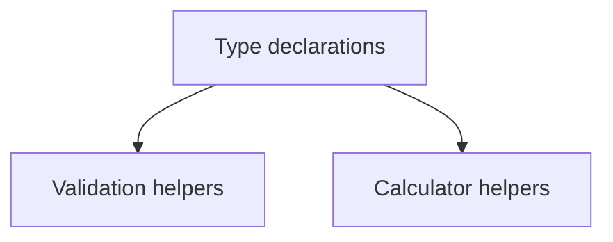

# types/adapters/itau/index.ts

## Overview

Defines Ita\u00fa adapter type contracts.

## Responsibilities

- Declare supported wallet union type.
- Declare structured result for "our number" calculation.

## Inputs and outputs

- Input: N/A
- Output: Type declarations.

## API / Signature

```ts
export type ItauWalletCode = '109' | '112' | '115' | '180';

export interface ItauOurNumberResult {
  baseNumber: string;
  checkDigit: number;
  formatted: string;
}
```

## Main flow



## Error handling and edge cases

- Not applicable (type-only module).

## Examples

```ts
const result: ItauOurNumberResult = {
  baseNumber: '12345678',
  checkDigit: 2,
  formatted: '123456782',
};
```

## Dependencies and integrations

- Used by Ita\u00fa adapter implementation modules.
