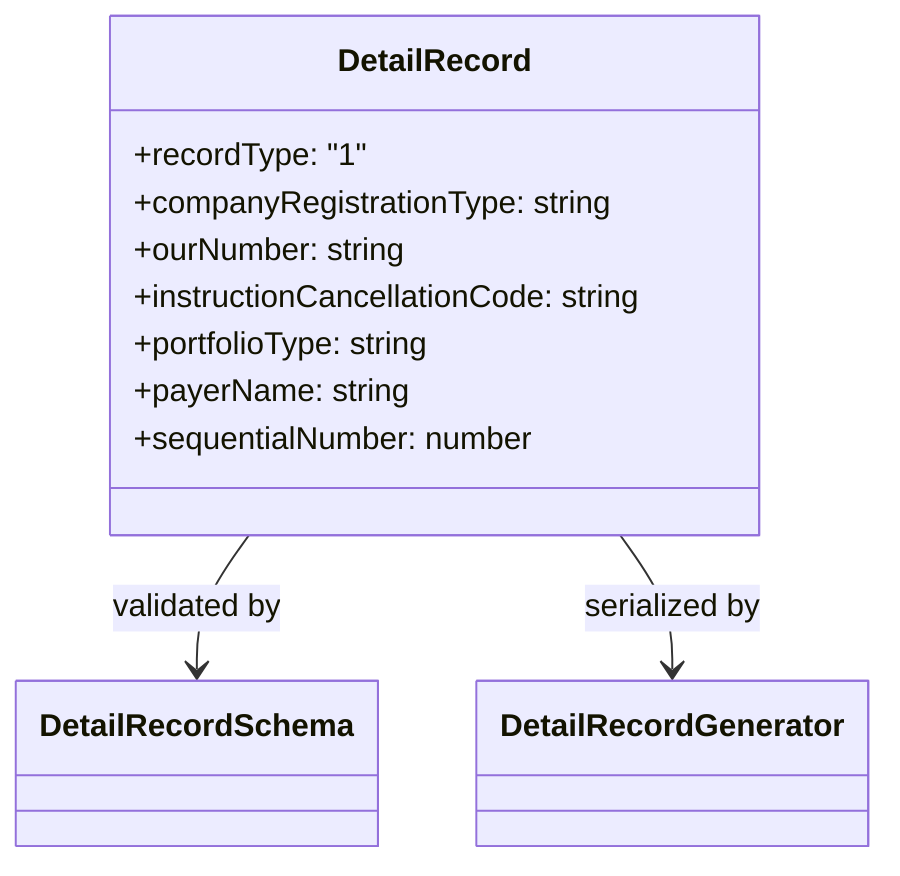

# DetailRecord (CNAB400)

## Visão geral

Define os dados de um registro detalhe tipo 1 dos arquivos CNAB400.

## Responsabilidades

- Descrever campos de beneficiário, pagador, documento, valores, datas e instruções.
- Tipar os campos opcionais usados por diferentes layouts bancários.
- Fornecer posições CNAB para interpretação e geração do registro.

## Entradas e saídas

- Entrada: valores de domínio preparados pelo consumidor do SDK.
- Saída: contrato `DetailRecord` validado e serializado pelo gerador CNAB400.

## Fluxo principal



## Tratamento de erros e casos-limite

- `instructionCancellationCode` é opcional e, quando presente, deve ter quatro dígitos.
- `portfolioType` é opcional e ocupa um caractere no campo específico do banco.
- Campos obrigatórios e limites são aplicados por `DetailRecordSchema`.

## Exemplos

```ts
const detail: DetailRecord = {
  recordType: '1',
  companyRegistrationType: '02',
  companyRegistrationNumber: '12345678000195',
  agency: '1234',
  account: '12345',
  accountDigit: '6',
  instructionCancellationCode: '0000',
  ourNumber: '00000001',
  portfolioCode: '109',
  portfolioType: 'I',
  dueDate: new Date('2026-10-14'),
  amount: 150,
  payerName: 'PAGADOR TESTE',
  sequentialNumber: 2,
};
```

## Dependências e integrações

- `DetailRecordSchema` para validação.
- Geradores de detalhe CNAB400 para remessa e retorno.
