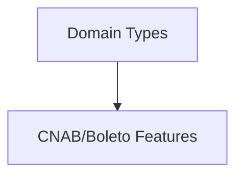

# CommonTypes

## Overview

Shared TypeScript interfaces describing core boleto entities such as addresses, tax IDs, and parties.

## Responsibilities

- Define reusable domain types for CNAB and boleto workflows.
- Serve as contracts for parsers, generators, and templates.

## Inputs and outputs

- Inputs: None.
- Outputs: TypeScript interfaces.

## API / Signature

```ts
export interface Address { /* ... */ }
export interface TaxId { /* ... */ }
export interface BankAccount { /* ... */ }
export interface Beneficiary { /* ... */ }
export interface Payer { /* ... */ }
export interface Discount { /* ... */ }
export interface Fee { /* ... */ }
export interface Fine { /* ... */ }
export interface Interest { /* ... */ }
```

## Main flow



## Error handling and edge cases

- None. Types are compile-time only.

## Examples

```ts
import type { Beneficiary, TaxId } from '@types/common';

const taxId: TaxId = { type: 'CNPJ', number: '12345678000195' };
const beneficiary: Beneficiary = { name: 'ACME', taxId, bankAccount: { bankCode: '341', branch: '0001', account: '12345', accountDigit: '9' }, address: { street: 'Rua A', district: 'Centro', city: 'São Paulo', state: 'SP', postalCode: '01001000' } };
```

## Dependencies and integrations

- None.
