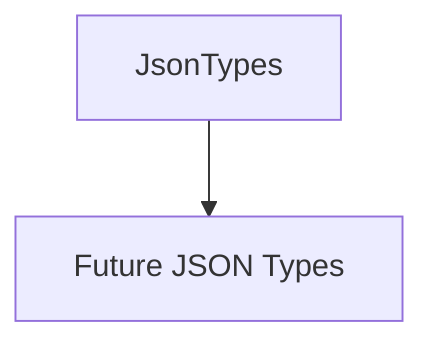

# JsonTypes

## Overview

Placeholder module for JSON-specific type exports.

## Responsibilities

- Provide a stable module path for future JSON type additions.

## Inputs and outputs

- Inputs: None.
- Outputs: `JSON_TYPES_PLACEHOLDER` constant.

## API / Signature

```ts
export const JSON_TYPES_PLACEHOLDER: boolean;
```

## Main flow



## Error handling and edge cases

- None.

## Examples

```ts
import { JSON_TYPES_PLACEHOLDER } from '@types/json';
```

## Dependencies and integrations

- None.
